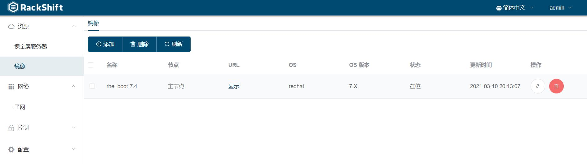

# 准备工作
  以浪潮 5280M4 为例

## 部署 RackShift
- 通过 [快速开始](quick_start.md) 提供的方式部署 RackShift

## 配置 PXE 使用的 DHCP 网段
 

!!! warning "注意"
    - 此处配置的 IP 地址段必须是 RackShift 的网卡所在的 PXE 网卡所在的地址段
    - 如果配置安装时配置服务器 IP 错误可以使用 rsctl reconfig 命令重设 IP 地址
    - 用户部署的 RackShift 服务器至少有一张网卡与物理机 PXE 网卡处于同一个网段（vlan）。并且配置开启 PXE 的 DHCP 网段必须和该网卡处于同一段。
    - 用于 PXE 的网络中不能存有其他 DHCP 服务器。
      
        
## 上传用于装机的 CentOS7.X 镜像

## 后端挂载 CentOS 镜像
- 上传镜像文件 CentOS.iso 到 /opt/rackshift/rac8khd/files/mount/common 目录
- 执行命令 mkdir -p /opt/rackshift/rackhd/files/mount/common/centos-test(名称可以随意写，只要不重复)
- 执行命令 mount CentOS.iso /mnt/
- 执行 cp -r /mnt/* /opt/rackshift/rackhd/files/mount/common/centos-test
- 在 WEB-UI 上添加镜像，选择后端挂载，URL 填 http://nodeIp:9090/common/centos-test 即可

!!! warning "注意"
    - 等待镜像上传完毕之后点击“提交/确定”按钮
    - 如果需要 Minimal 版本，请到 https://docs.rackshift.io/iso/ 下载 ！官网的 Minimal 镜像没有 curl 等工具会造成 RackShift 工作流不能正常结束

