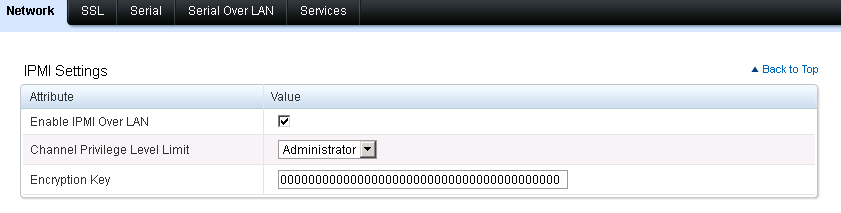
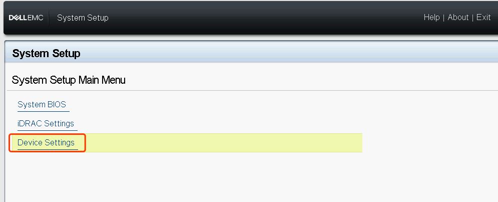
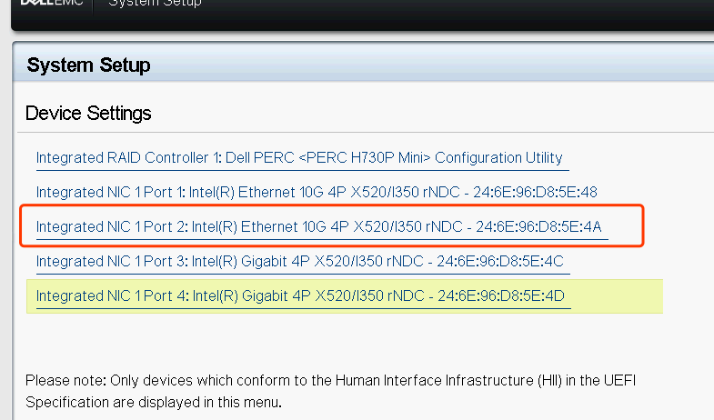
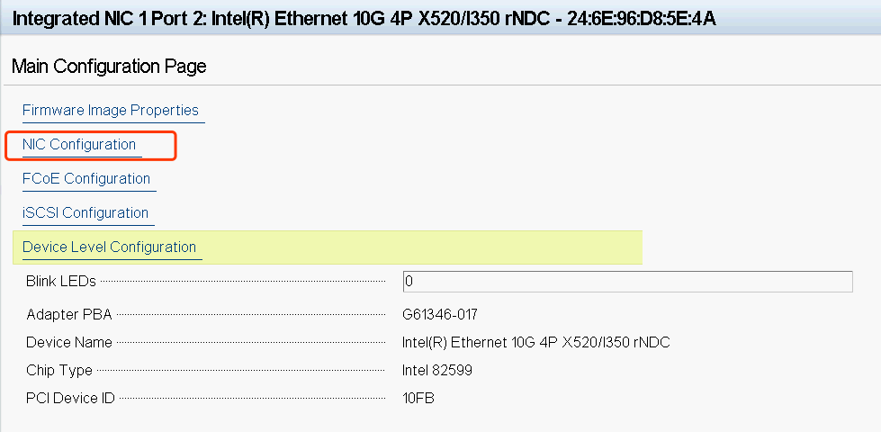
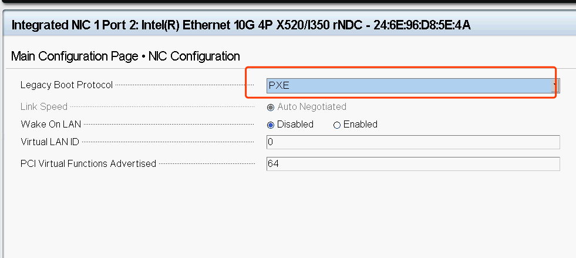

# 初始化物理机(以DELL为例)
## DELL 服务器开启 IPMI  

  

打开 IDRAC web 页面
!!! 步骤
    - 保证 "Enable IPMI Over LAN" 对勾勾上
    - 保证 "Channel Privilege Level limit" 为 “Administrator” 或者 “管理员”（中文）
## Dell 服务器网卡打开 PXE 模式
### 重启进入SystemSetup，选Devicce Settings  

### 选择要打开PXE的网口(推荐打开所有网卡的 PXE 模式，因为你可能不知道哪块具体的网卡连上了 RackShift，PXE时会轮询)  

### 选择NIC Configuration  

### 配置Legacy Boot Protocol为PXE  

### 点击Finishi  

!!! 注意
    - 所有需要自动化 PXE， 装机，RAID 的物理机都必须保证 IPMI Over Lan 开启，带外信息配置正确（RackShift 因为需要控制重启）
    - 所有需要自动化 PXE，装机，RAID 的物理机 PXE 网卡必须正常，有时候 PXE 不正常可能是网卡损坏