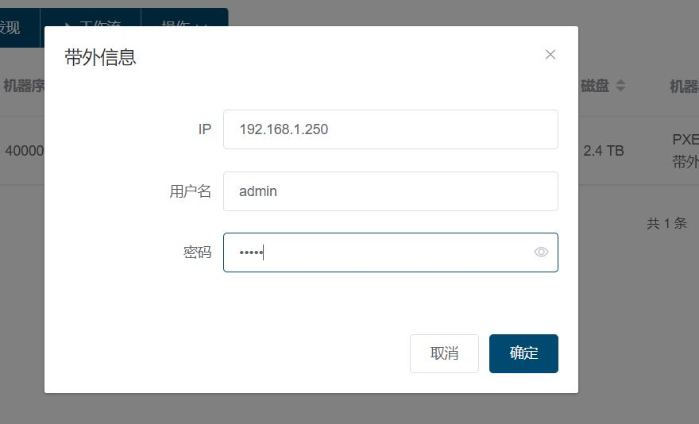

# 部署您的第一台物理机
    以浪潮5280M4为例

## 部署 RackShift
- 通过 [快速开始](quick_start.md) 提供的方式部署 RackShift

## 初始化 RackShift
1. 配置 PXE 使用的 DHCP 网段
 
2. 上传用于装机的 Centos7.X 镜像

##### 注意：
- 用户部署的 RackShift 服务器至少有一张网卡与物理机 PXE 网卡是直连。并且配置开启 PXE 的 DHCP 网段必须和该网卡处于同一段。
- 用于 PXE 的网络中不能存有其他 DHCP 服务器。 

## PXE 启动物理机
您可以选择以下几种方式 PXE 启动物理机  

1. 手动启动物理机，选择从网络启动
2. 打开远程 KVM 控制台，选择从网络启动
3. 在 RackShift 服务器或与物理机带外连通的服务器上面安装 ipmitool 工具执行如下命令  
  
    1. ipmitool -I lanplus -H xxx -U xxx -P xxx chassis bootdev pxe  
    2. ipmitool -I lanplus -H xxx -U xxx -P xxx chassis power on / reset

如果一切顺利，您将会在物理机显示器上看到如下的画面，表示物理机正在执行首次的发现流程，这个过程需要耗费几分钟,请您耐心等待。  

等待几分钟后您将会在裸金属列表看到这台发现完毕的物理机

## 配置带外信息
您选择这条物理机的记录，点击操作->点击带外信息

输入该机器的带外账号密码点击确定，至此 RackShift 将会拥有对该物理机进行自动化部署的能力。
    

