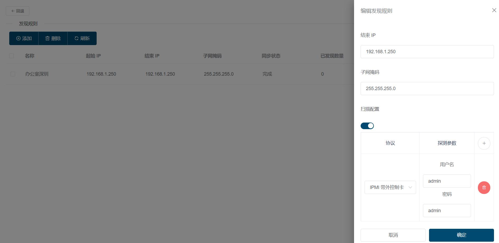
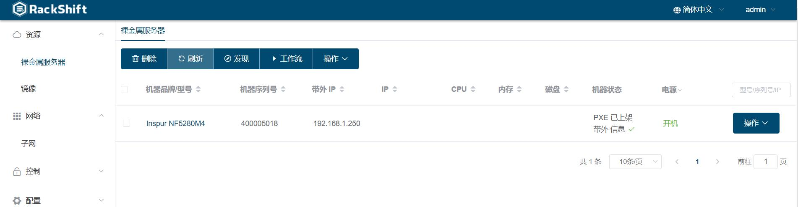
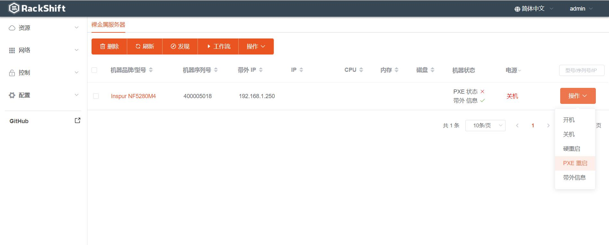
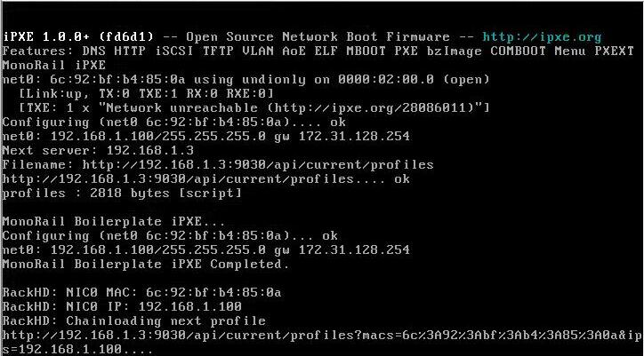
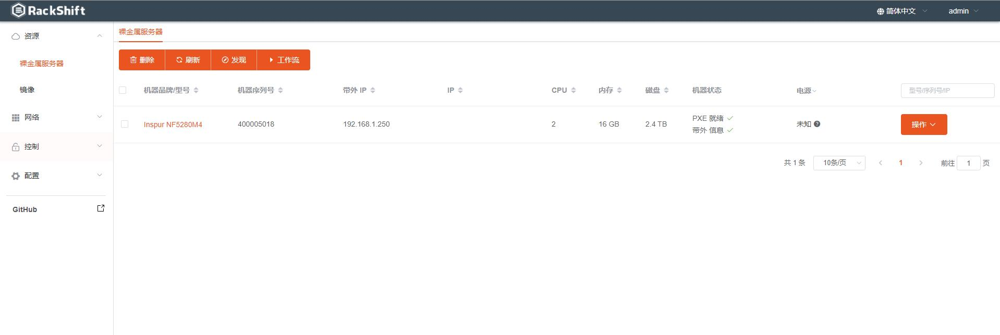
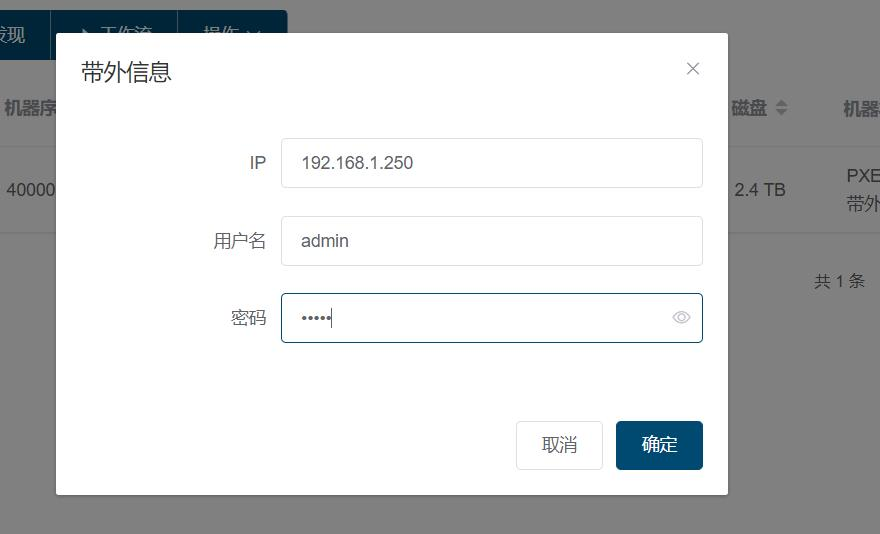
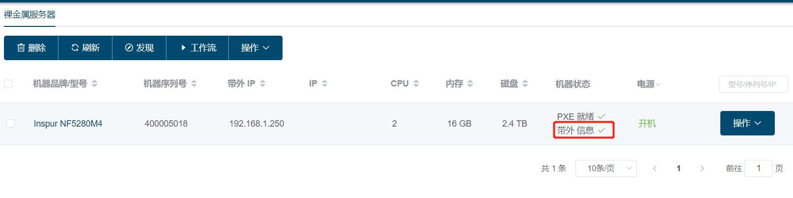

# 发现物理机
  以浪潮5280M4为例
  !!! warning "注意"
      如果是 DELL 或者 HP 机器请确保物理机开启了 IPMI Over LAN 功能！
## 通过带外 IPMI/SNMP 扫描发现物理机（被动发现）
点击裸金属页面“发现”按钮，配置好需要扫描的带外地址段以及带外可能的账号和密码

点击同步，一段时间后将会根据 IPMI 发现地址段内存在的物理机（只能抓取到型号序列号等信息）

现在这台 Inspur 5280M4 已经通过 IPMI 被动发现到了，此时还无法给它进行部署装机，点击“PXE 重启”按钮，让物理机主动发现

## PXE 启动物理机 (主动发现)
您可以选择以下几种方式 PXE 启动物理机  

!!! info "PXE 启动步骤"
        * 手动启动物理机，选择从网络启动
        * 打开远程 KVM 控制台，选择从网络启动
        * 在 RackShift 服务器或与物理机带外连通的服务器上面安装 ipmitool 工具依次执行如下命令 (将 xxx 替换为对应的带外 IP，账号，密码) 
        ``` sh
        ipmitool -I lanplus -H xxx -U xxx -P xxx chassis bootdev pxe  
        ipmitool -I lanplus -H xxx -U xxx -P xxx chassis power on
        ipmitool -I lanplus -H xxx -U xxx -P xxx chassis power reset
        ```

如果一切顺利，您将会在物理机显示器上看到如下的画面，表示物理机正在执行首次的发现流程，这个过程需要耗费几分钟,请您耐心等待。  



等待几分钟后您将会在裸金属列表看到这台发现完毕的物理机

## 配置带外信息
您选择这条物理机的记录，依次点击操作->带外信息

输入该机器的带外账号密码并点击确定，至此 RackShift 将会拥有对该物理机进行自动化部署的能力。

    

