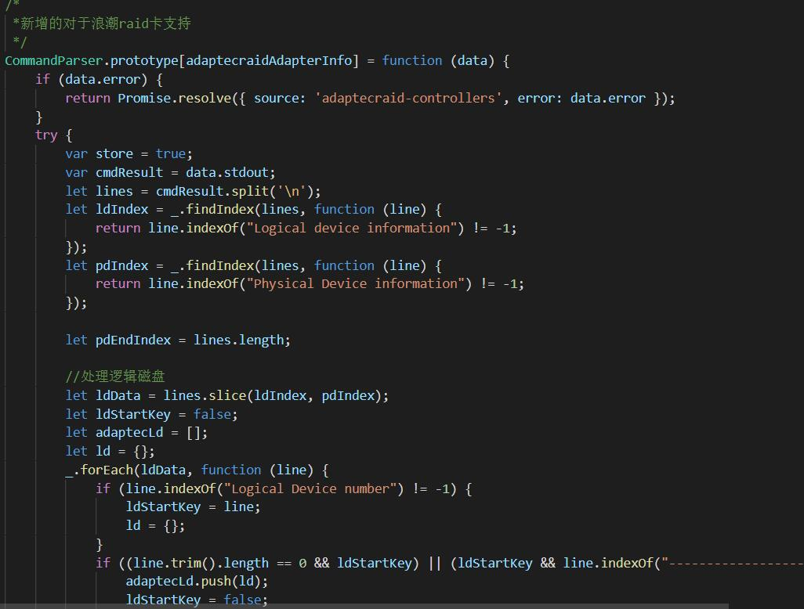

# RackShift 对 RackHD 的扩展
### PXE 发现
    RackHD 基于 iPXE 默认识别的机型有限，我们定制了 iPXE 文件，支持了部分新机型。
   [iPXE项目](https://ipxe.org/docs)
### RAID 卡
    RackHD 对于 RAID 卡通常有三种基本操作：Catalo（搜集），Create（创建），Erase（擦除）
    默认支持的只有 MegaRAID 以及 Quanta RAID 卡， RackShift 针对浪潮，中兴，华三以及惠普等服务器定制了这三种操作
    
   
