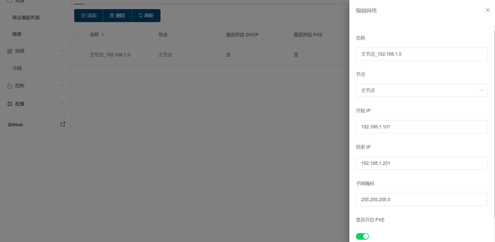

# 故障排除
### Q：通过 rsctl status 发现有的服务无法启动

如图 rackshift_dhcp_1 服务器使用的是开源的 isc-dhcp-server，该服务器规定了必须至少绑定一块网卡才可以正常启动，这里我们一般都是绑定提供 PXE 功能的
网卡的地址段，比如192.168.2.0/24

回到 RackShift 界面在网络页面，配置好正确的 DHCP 地址段，点击确定，dhcp 服务将会自动重启,故障解决。

### Q：PXE 网段发生变化，怎么重置 RackShift IP
使用 rsctl reconfig 命令重置即可
 
### Q：服务器无响应？
使用 rsctl restart 命令尝试重启。如果不能成功请确认 RackShift 服务正确的运行的 PXE 网卡之上，并且尝试 rsctl reconfig
重设为正确的 IP 地址 

### Q：制作 RAID 报错

检查磁盘是否做过raid，如果有必须先执行清空 raid 操作才能执行制作 raid
 
