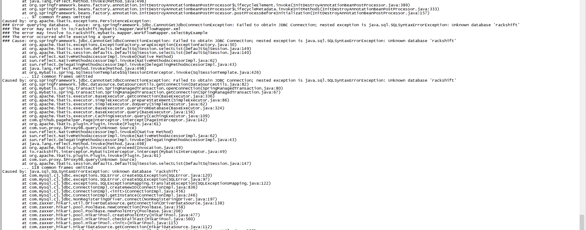

# 故障排除
### Q：rackshift 主服务无法启动，8082 端口无法访问

这个故障一般是 mysql 容器与 rackshift 服务主容器第一次安装启动的联动问题。
执行如下命令  

- rm -rf /opt/rackshift/data/mysql
- rsctl reload
如果 reload 还是不启动可以再多次 rsctl reload

如果还是没有正常启动并且报了如下错误

必须手动创建 mysql 数据库了，依次执行如下命令

- docker cp /opt/rackshift/conf/mysql/sql/rackshift.sql rackshift_mysql_1:/
- docker exec -it rackshift_mysql_1 sh
- mysql -uroot -padmin
- create database rackshift;
- use rackshift;
- source /rackshift.sql
- rsctl reload (再重启服务)

### Q：通过 rsctl status 发现有的服务无法启动

如图 rackshift_dhcp_1 服务器使用的是开源的 isc-dhcp-server，该服务器规定了必须至少绑定一块网卡才可以正常启动，这里我们一般都是绑定提供 PXE 功能的
网卡的地址段，比如192.168.2.0/24

回到 RackShift 界面在网络页面，配置好正确的 DHCP 地址段，点击确定，dhcp 服务将会自动重启,故障解决。

### Q：PXE 网段发生变化，怎么重置 RackShift IP
使用 rsctl reconfig 命令重置即可
 
### Q：服务器无响应？
使用 rsctl restart 命令尝试重启。如果不能成功请确认 RackShift 服务正确的运行的 PXE 网卡之上，并且尝试 rsctl reconfig
重设为正确的 IP 地址 

### Q：制作 RAID 报错

检查磁盘是否做过raid，如果有必须先执行清空 raid 操作才能执行制作 raid

### Q：无法引导 PXE

把引导模式切换成 bios/legacy 吧
如果还是不行尝试安装下面顺序重启服务，记住 firewalld 不能关闭
systemctl restart network
systemctl restart docker
systemctl restart firewalld
rsctl reload

### Q：一直处在发现中 无法搜集信息

登录账号密码： rancher / monorail 发现没有任何运行的 docker 容器（搜集硬件信息 agent）

下载[rancher1.2内核](static/rancher1.2.tar.gz)文件,依次执行  

- tar zxvf rancher1.2.tar.gz
- cd rancher && sh rancher.sh
- 再 PXE 重启服务器即可
