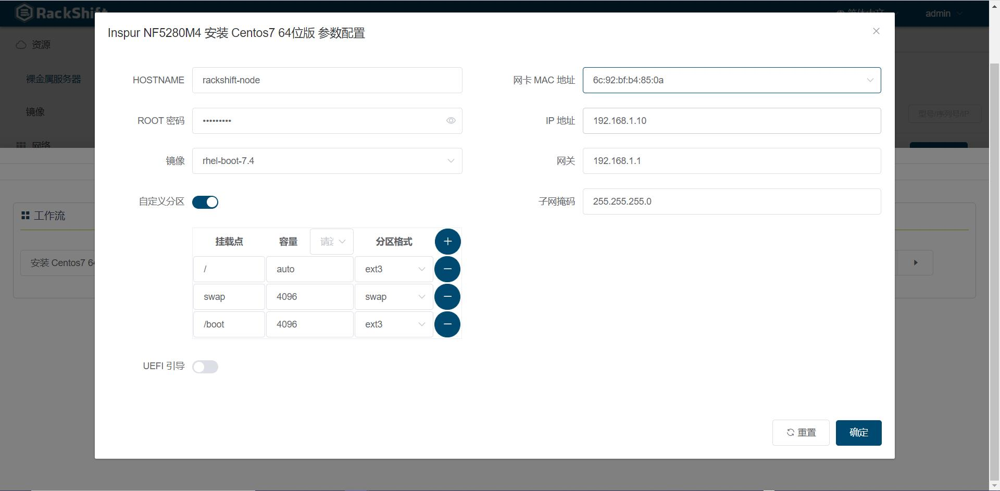

# 欢迎来到 RackShift ！

RackShift 是开源的裸金属服务器管理平台，功能覆盖裸金属服务器的发现、带外管理、RAID 配置、固件更新、操作系统安装等。RackShift 要解决的问题包括：

- 各种网络环境下裸金属服务器的自动、手动发现；
- 裸金属服务器的带外控制管理，包括开关机、重启、配置 PXE 等；
- 裸金属服务器批量 RAID 配置、固件更新、装机等。

RackShift 遵循 GPL v2 开源协议，使用 SpringBoot/Vue 进行开发，界面美观、用户体验好，集成并扩展 RackHD，支持的X86 服务器品牌包括浪潮、戴尔、华为、联想、惠普等。RackShift 的技术优势包括：

- 全生命周期: 能够覆盖裸金属服务器从发现、配置、装机、重置的全生命周期管理；
- 自动化：基于 PXE 或者带外协议实现远程自动化，解放机房运维人员；
- 易操作: 浏览器可视化操作界面，易于操作和管理。

## 界面展示

* 物理机
  
* RAID
  
* 装机
  

## 已支持机型

<table>
<thead>
<tr><td>品牌</td><td>型号</td></tr>
</thead>
<tbody>
<tr>
<td>DELL EMC</td>
<td>Power Edge R630 R640 R720 R730 R740 R910 R920 R930系列</td>
</tr>
<tr>
<td>HPE</td>
<td>Proliant 380 580 Gen8 Gen 9 Gen 10 系列</td>
</tr>

<tr>
<td>Inspur</td>
<td>5280 8480 M4 M5 系列</td>
</tr>

<tr>
<td>IBM</td>
<td>X3550 X3650 M4 系列</td>
</tr>

<tr>
<td>H3C</td>
<td>R4900 G3 系列</td>
</tr>

<tr>
<td>ZTE</td>
<td>R5300 G4 系列</td>
</tr>

</tbody>
</table>

## 技术栈

- 前端: [Vue.js](https://vuejs.org/)
- 后端: [Spring Boot](https://www.tutorialspoint.com/spring_boot/spring_boot_introduction.htm)
- 数据库: [MySQL](https://www.mysql.com/)

RackShift 使用、集成、借鉴的开源项目如下，在此致谢：

-  [RackHD](https://rackhd.github.io/)：RackShift 集成和参考了 RackHD 提供的裸金属服务器管理能力和思路；
-  [MAAS](https://maas.io/)：RackShift 参考了 MAAS 提供的裸金属服务器生命周期纳管思路；
-  [Digital Rebar](https://rackn.com/rebar/)：RackShift 参考了 Digital Rebar 提供的操作方式和 UI 参考；
-  [Element](https://element.eleme.cn/#/)：RackShift 使用 Element 提供的优秀前端组件库。

## 项目推荐

- [JumpServer 开源堡垒机](https://github.com/jumpserver/jumpserver)
- [MeterSphere 开源持续测试平台](https://github.com/metersphere/metersphere)
- [KubeOperator 开源容器平台](https://github.com/KubeOperator/KubeOperator)
- [RiskScanner 开源公有云安全合规扫描平台](https://github.com/RiskScanner/riskscanner)
