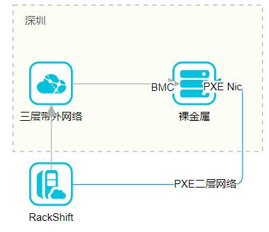

# 网络结构

## 网络拓扑

RackShift 部署在一台与带外网络三层可达，与裸机 PXE 网卡二层可达的一台虚拟机/物理机上。

（注意：RackShift 必须与裸机 PXE 在二层网络直连,否则请您联系我们进行特殊定制）

## 端口

## tcp
 * 80 (RackShift 服务)
 * 8083(RackShift-proxy 服务)
 * 9090(RackHD http 服务)
 * 9030(RackHD task 服务)
 
## udp
 * 4011(DHCP-proxy 服务)
 * 67(DHCP 服务)
 * 69(TFTP 服务)

#### 注意：
- RackShift 安装完毕之后会自动开启上述所有端口