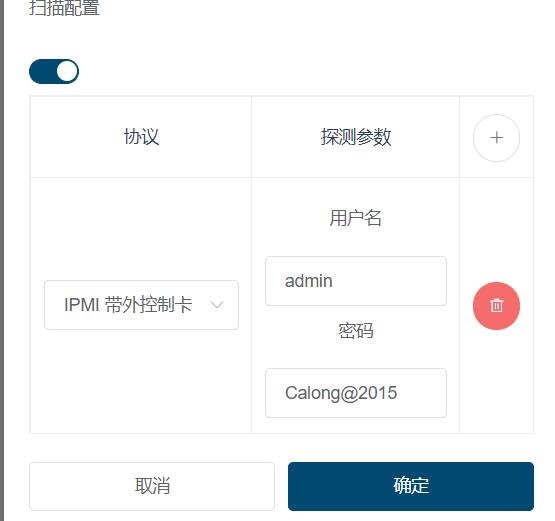

# 被动发现

### 一台物理机是如何被 RackShift 扫描发现的？
    RackShift 通过集成 IPMITOOL，使用用户填入的探测密码账号进行测试，如果可以联通则获取物理机的基础信息填入数据库。

    RackShift 使用 IPMITOOL 搜集基础信息

!!! warning "注意"
        此种发现的物理机还必须通过 RackShift 的主动发现才可以进行部署装机。

