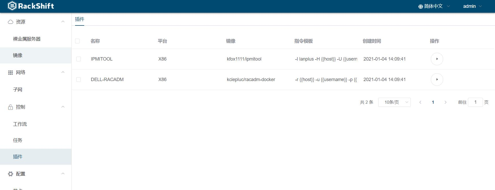
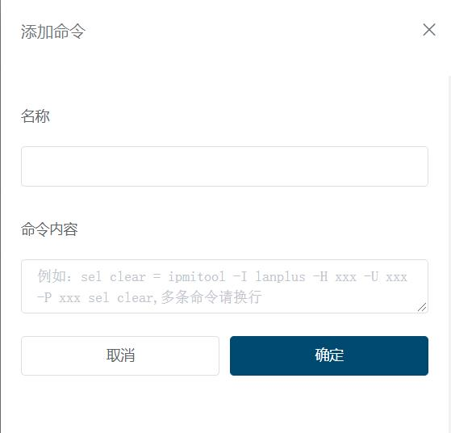
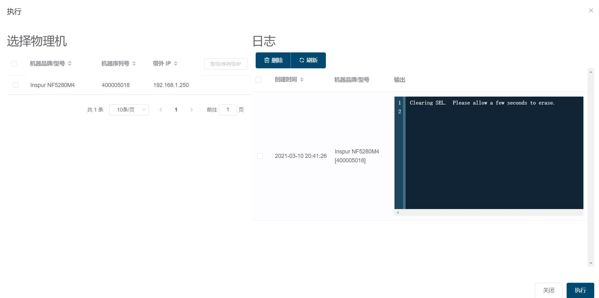

# IPMITOOL 使用
## 
*   打开插件页面
   
    
*  点击“执行命令”按钮
   
   
*  点击“添加”按钮
   
   
*  点击“执行”按钮
   
   添加 ipmitool 对应的命令，这里类似于管理员手动批量给物理机执行 ipmitool 的命令，如果有多条命令可以换行
   
*  选择配置好了带外信息的物理机，点击“执行按钮”
   
   
   这样我们就可以通过灵活的方式组合 IPMI 命令来批量管理或者查询物理机的信息
*  类比于 IPMITOOL RACADM 工具也是同样的使用方法，如果您先进一步了解 RACADM 的使用可以查询其命令    
