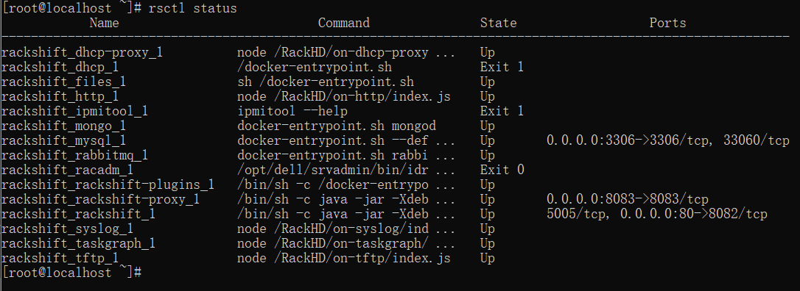

# 快速开始

#### 前期工作

- [网络准备](network.md)
- 准备一台不小于 8 G内存的 64位 CentOS 7 / RHEL 7 以上 Linux 主机；

#### 在线安装

 ```sh
 sh -c "$(curl -sSL https://github.com/rackshift/rackshift/releases/latest/download/quick_start.sh)"
 ```

#### 离线安装

* 百度网盘安装包： (https://pan.baidu.com/s/1v0QYNZr1KGDlOxzlyoVGdA 提取码: ebz4)
* tar -zxvf rackshiftV1.4.0-offline.tar.gz
* cd rackshiftV1.4.0-offline/installer
* ./install.sh

!!! warning "注意"
安装过程中需要您手动输入服务器上用作 PXE 的网卡 IP 地址作为 RackShift 服务器的 IP 地址


安装过程截图


安装成功后您可以通过浏览器访问 RackShift WEB 控制台

``` sh
地址: http://ip:80
账号：admin
密码：123   

```

通过 rsctl status 查看服务状态


rackshift_dhcp_1 是负责 PXE DHCP 的服务，我们需要打开 webui 在 [子网](config.md) 页面配置正确的 DHCP 网段，该服务就可以正常启动
!!! info "控制命令"

    - rsctl status 查看 RackShift 服务运行状态 
    - rsctl start 启动 RackShift 服务 
    - rsctl stop 停止 RackShift 服务 
    - rsctl restart 重启 RackShift 服务 
    - rsctl reload 重新加载 RackShift 服务 
    - rsctl reconfig 重设 RackShift 服务 IP（PXE 网卡） 地址 
    - rsctl upgrade 升级 RackShift 至最新版本 
    - rsctl uninstall 卸载 RackShift 服务 
    - rsctl version 查看 RackShift 版本信息