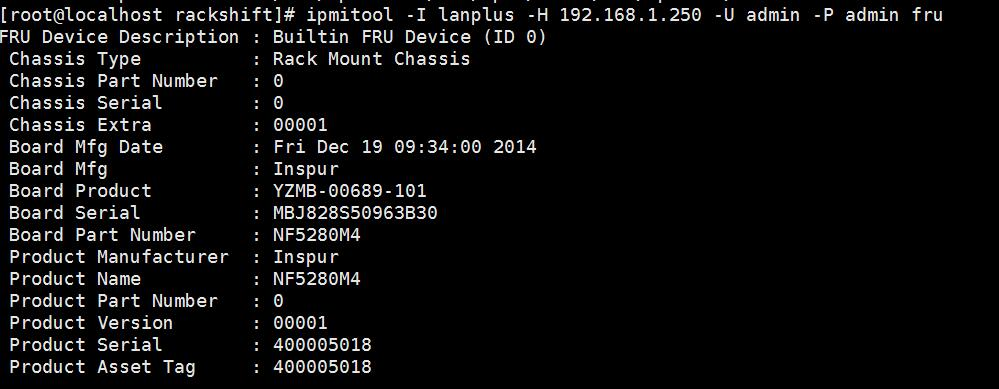

# 术语
### 主动发现与被动发现
    被动发现：通过外部的方式告知 RackShift 这里存在一台或者多台设备，在 RackShift 中通过发现按钮扫描 IP 地址段发现。
    主动发现： 物理机在 RackShift 管理的网络中 PXE 启动， RackShift 接收到 MAC 地址，如果这个 MAC 地址没有记录在案
    则会新增一条物理机记录，并且启动一个 Discovery 的工作流。

### 主动发现

### [一台物理机是如何被主动发现的？](https://yyscamper.gitbooks.io/the-way-to-rackhd-development/content/deep-dive-into-source-code/how-a-compute-node-is-discovered.html)

### 被动发现

### 一台物理机是如何被 RackShift 扫描发现的？
    RackShift 通过集成 IPMITOOL，使用用户填入的探测密码账号进行测试，如果可以联通则获取物理机的基础信息填入数据库。

    RackShift 使用 IPMITOOL 搜集基础信息

!!! warning "注意"
        此种发现的物理机还必须通过 RackShift 的主动发现才可以进行部署装机。

### 工作流
    一个或者多个任务的组合描述定义