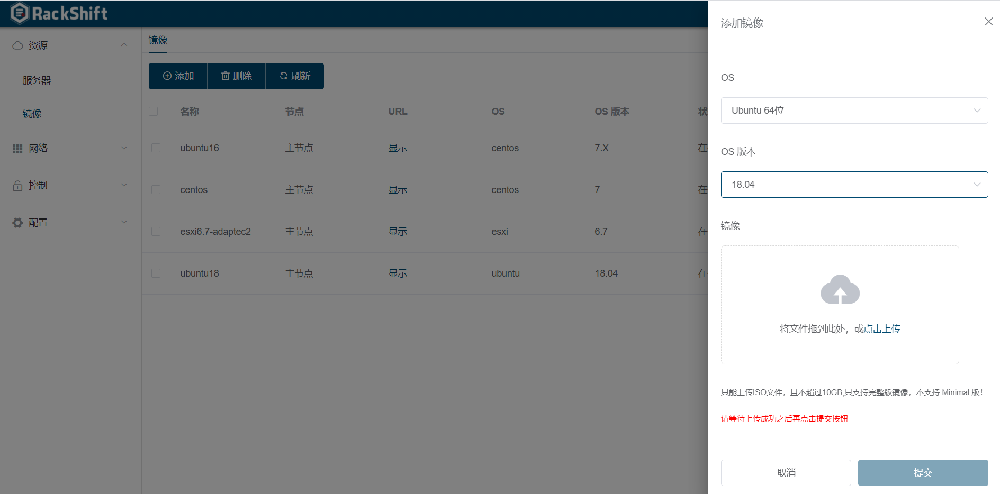
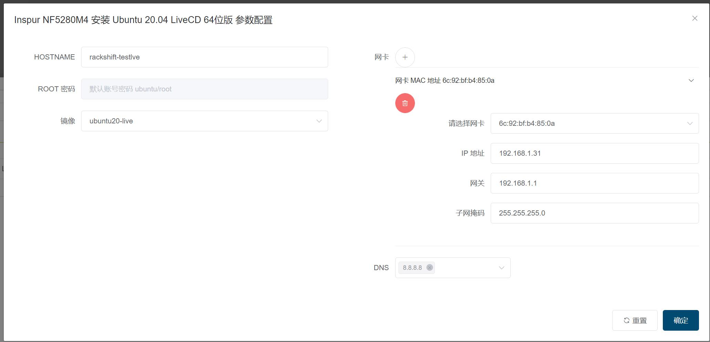

# Ubuntu 20.04 安装

## 下载镜像

从 https://pan.baidu.com/s/1HBgmpd6N0UEhq4Kyigmb_A提取码：f42v 下载支持 subiquity 启动的服务器镜像

!!! warning "注意"
        * 此种方式支持 subiquity 方式的 ISO 装机，目前经过测试的是官方 ubuntu-20.04.2-live-server-amd64.iso 版
        

## 上传镜像

## 执行安装 Ubuntu 20.04 工作流

!!! warning "注意"
        * 目前不支持自定义账号密码，默认是 ubuntu/root 等待后面版本支持
        * 目前不支持 Vlan BOND LVM 特性