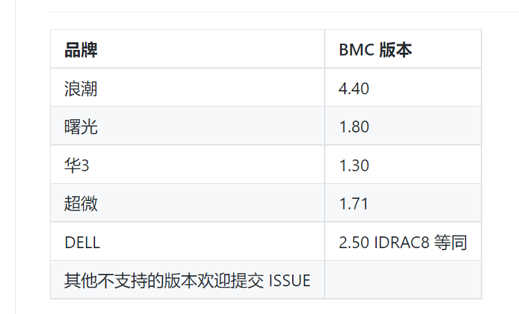
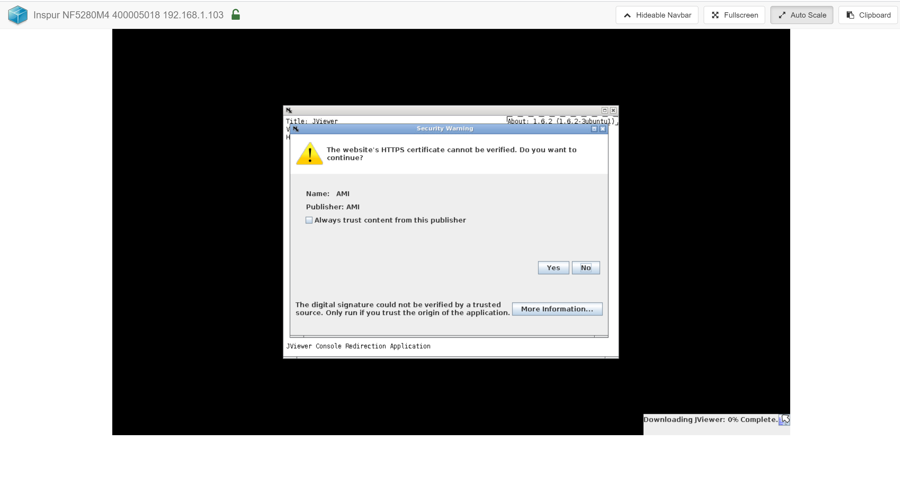
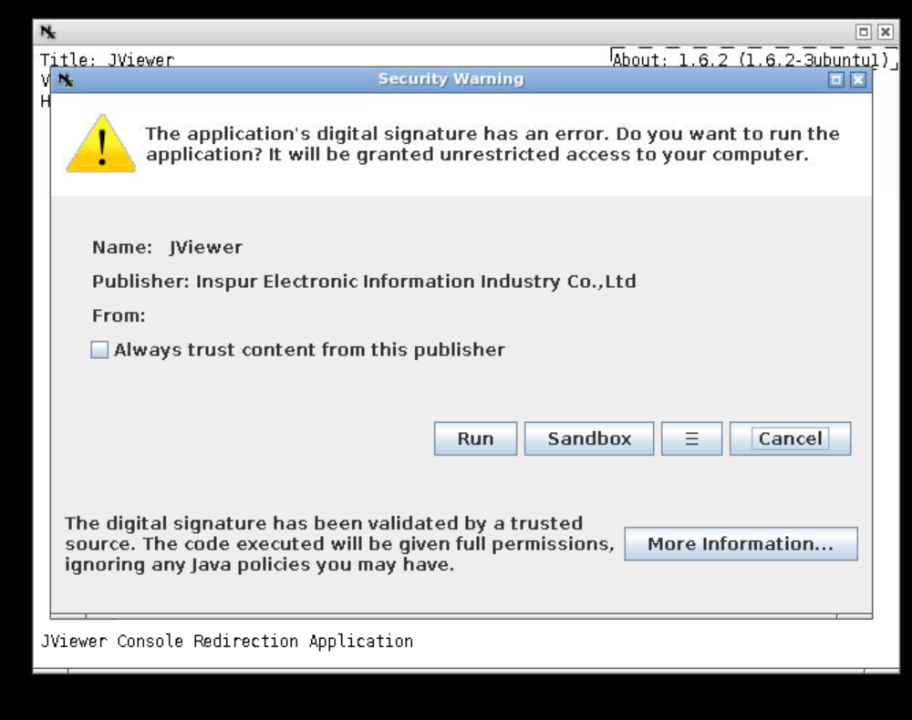
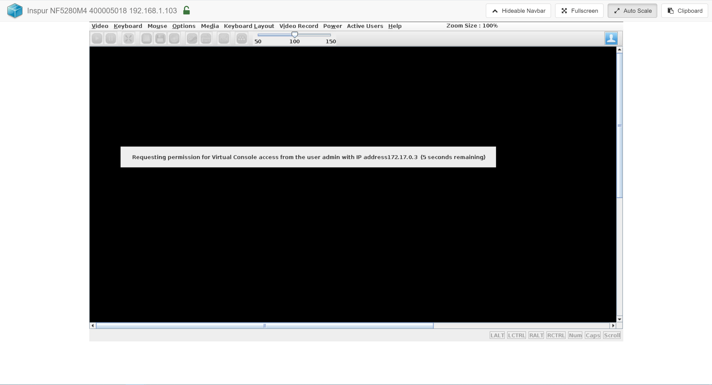

# 远程 KVM 控制台

## 使用方法

* 发现机器后确认 IPMI 带外信息正确
* 选择服务器点击“操作”按钮，选择“远程 KVM 控制台”
* 目前支持的机器型号和 BMC 对应版本 (https://github.com/rackshift/webkvm)
  
* 等待几秒后会打开新的页面提示安装 Jviewer 等
  
  一路确定 yes 之后安装
  
  成功看到显示器画面
  