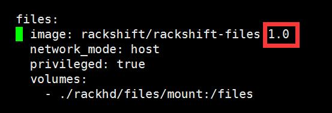
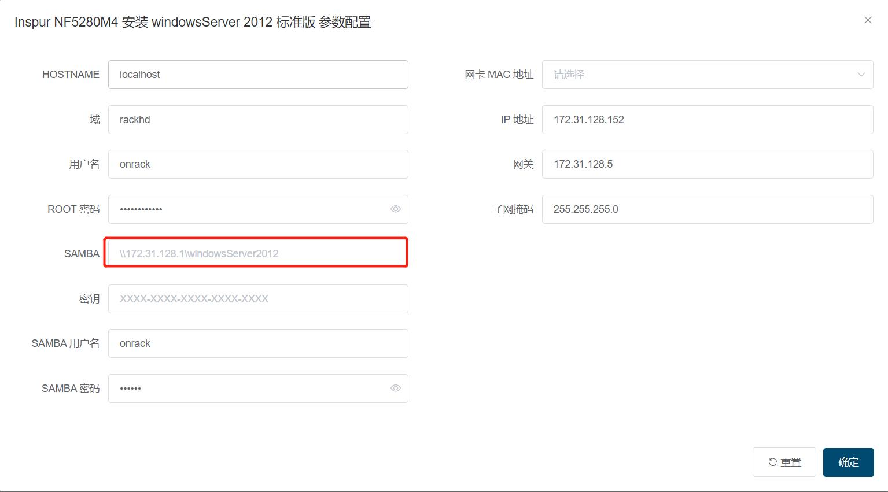

# Windows Server 安装
## 部署 Samba 服务器  

*   在 RackShift 上安装 Samba
    ````
    yum install samba
    ````
*   创建 Windows 镜像挂载目录
    ````
    mkdir -p /opt/iso/windowsServer2012 && chmod 777 /opt/iso/windowsServer2012
    ````
*   挂载 windows 镜像
    ````
    mount windowsServer2012.iso /opt/iso/windowsServer2012
    ````
*   修改 smb.conf
  ````
  vi /etc/samba/smb.conf
  ````
*   输入如下内容  
  ````
    [windowsServer2012]
    path = /opt/iso/windowsServer2012
    browseable = yes
    writeable = yes
  ````
*   添加用户访问 samba 的用户
    ````
    groupadd www
    useradd www -g www
    ````
*   设置用户 www 的密码
    ````
    smbpasswd -a www
    ````
*   重启 samba 服务
   ````
    systemctl restart smb
   ````
*   从windows访问 \\ip\windowsServer2012
    如果不能打开请关闭 selinux 执行命令 
    ````
    setenforce 0
    ````
*   在弹出来的对话框输入设置的用户名和密码 www/www
   
    
    
## 下载 winpe 镜像
   1. 修改 /opt/rackshift/docker-compose.yml files 镜像为 2.0 或者以上版本 image: rackshift/rackshift-files:1.0 => image: rackshift/rackshift-files:2.0
       
    
   2. rsctl reload 即可
   (如果是内网机器，请先在有外网的机器上执行 docker pull rackshift/rackshift-files:2.0, docker save rackshift/rackshift-files:2.0 | gzip > files.tar.gz ，然后拷贝到内网机器，执行 gunzip -c files.tar.gz | docker load 加载，离线包默认不提供该镜像)
   
   
!!! info "为什么？"
    考虑到离线包的大小太大，因此默认没有引入 WINPE

## 执行安装 windowsServer2012 工作流

