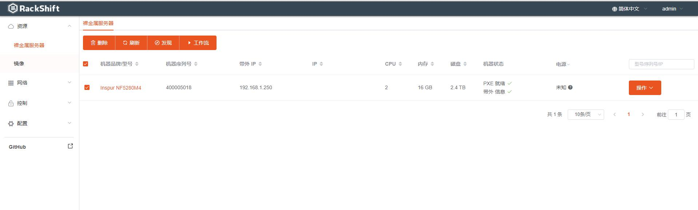
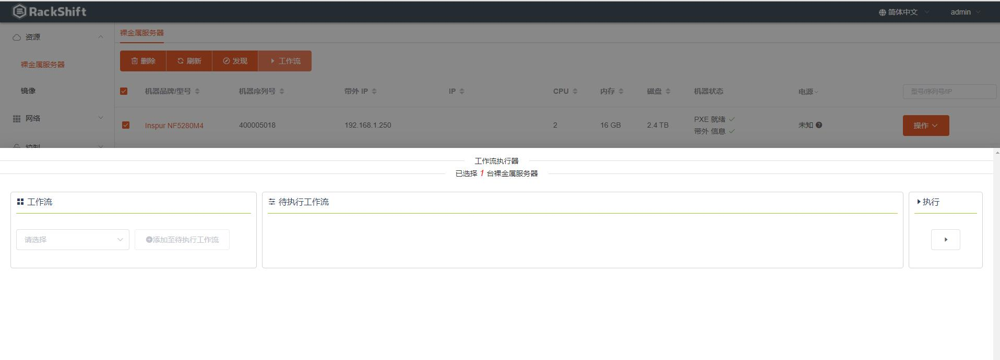
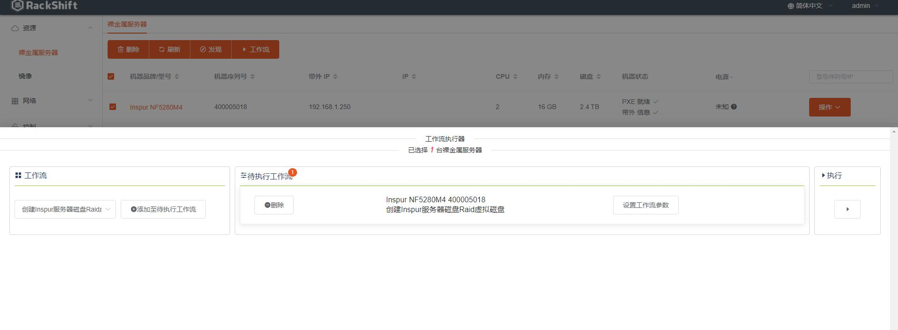
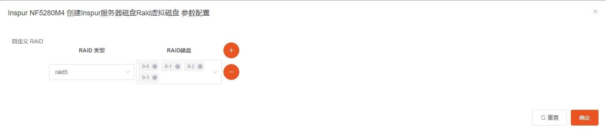
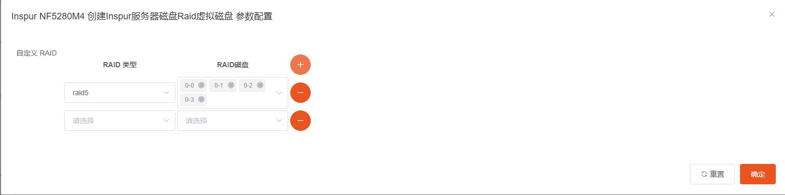
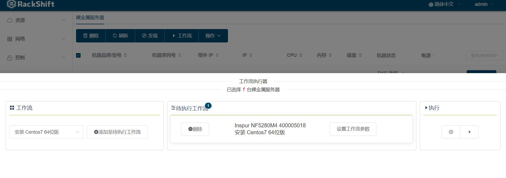
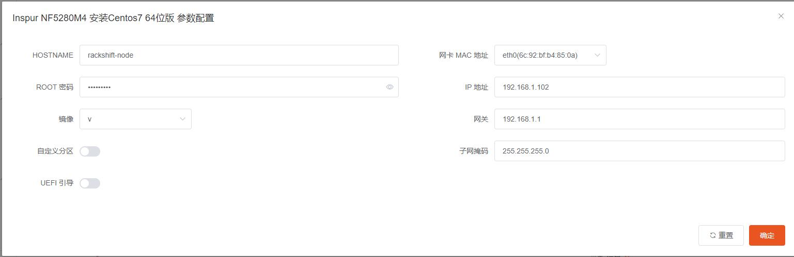
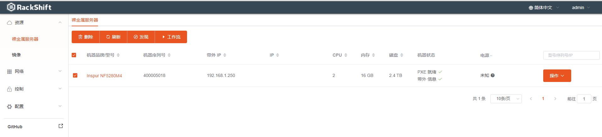
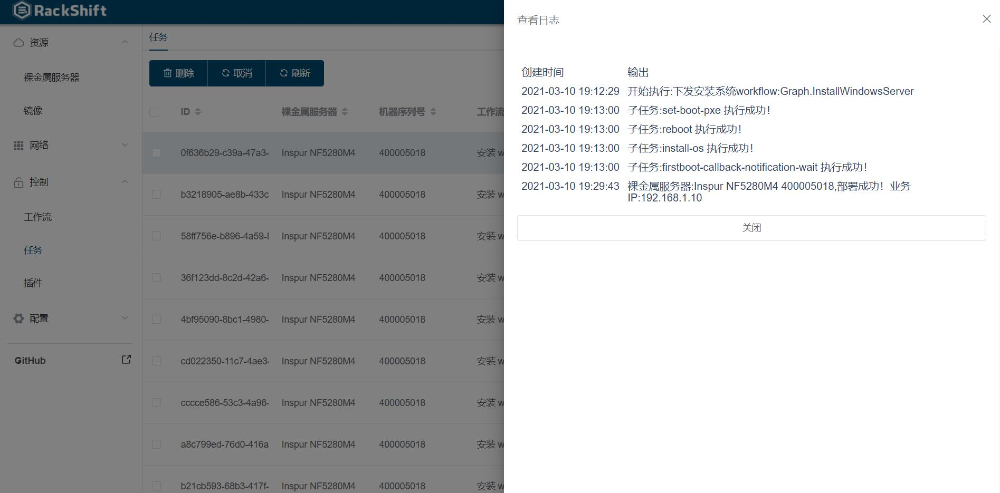
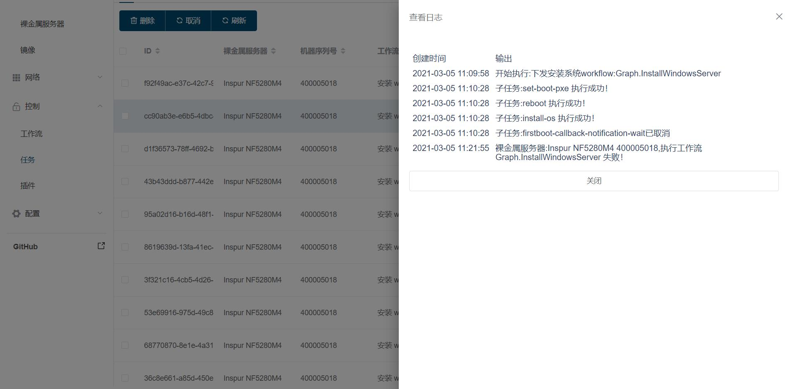

# 执行工作流
    以浪潮5280M4为例

## 创建 RAID
- 裸金属页面选择物理机

- 点击“工作流”按钮

- 选择“创建 Inspur 服务器磁盘 RAID 虚拟磁盘”工作流
- 点击“添加至待执行工作流”按钮

- 点击“设置工作流参数”配置 RAID 类型以及 RAID 需要的磁盘

- 可配置多组 RAID

- 点击“确定”按钮保存配置
- 回到裸金属页面点击”三角形“的执行按钮执行任务
- 可以重复添加需要执行的其他任务

## 安装 CentOS7
- 上传 OS 镜像

!!! warning "注意"
    RackShift 只支持 7.0 以上系统安装,并且默认支持从官网下载的完整版 ISO 镜像,一般大小在 4G 左右，如果需要使用 Minimal 镜像请到 https://docs.rackshift.io/iso/ 下载精简版镜像，官网的精简版镜像默认不支持
    
- 裸金属页面选择物理机
- 点击“工作流”按钮

- 选择“安装 CentOS7 64位”工作流

- 点击“添加至待执行工作流”按钮

- 点击“设置工作流参数” CentOS7 安装需要的参数

!!! info "参数解析"
    - 网卡 MAC 地址: 系统安装完毕后指定静态 IP 地址的网卡
    - UEFI 引导: 如果您确认您的机器 BIOS 引导模式是 EFI 或者 UEFI 请一定打开此选项，否则装机失败
    
 - 点击“确定”按钮保存配置
- 回到裸金属页面点击”三角形“的执行按钮执行任务
- 可以重复添加需要执行的其他任务

## 任务列表观察执行日志

- 打开“任务”页面

- 正确部署日志

- 查看错误日志
